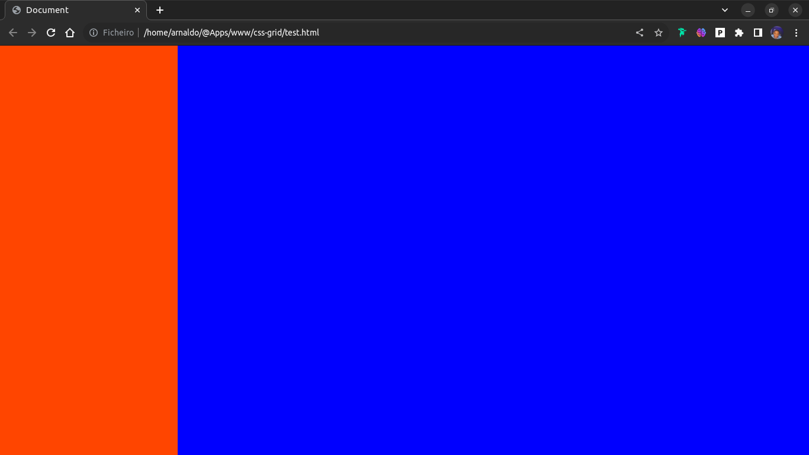
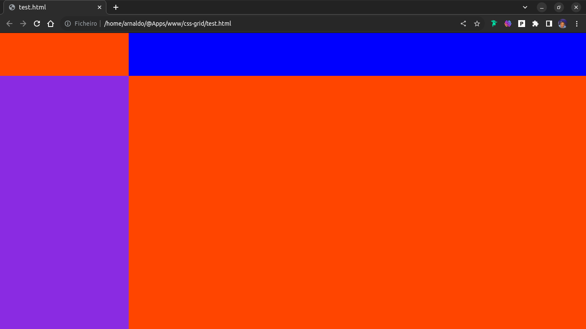
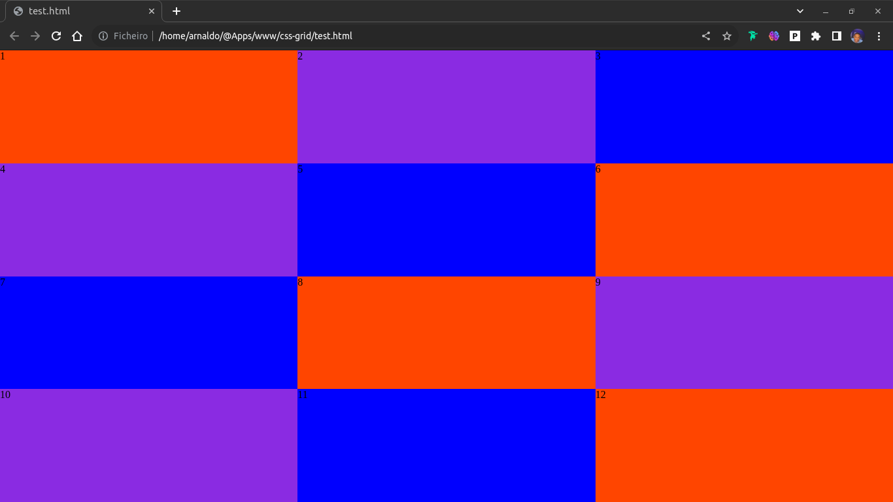
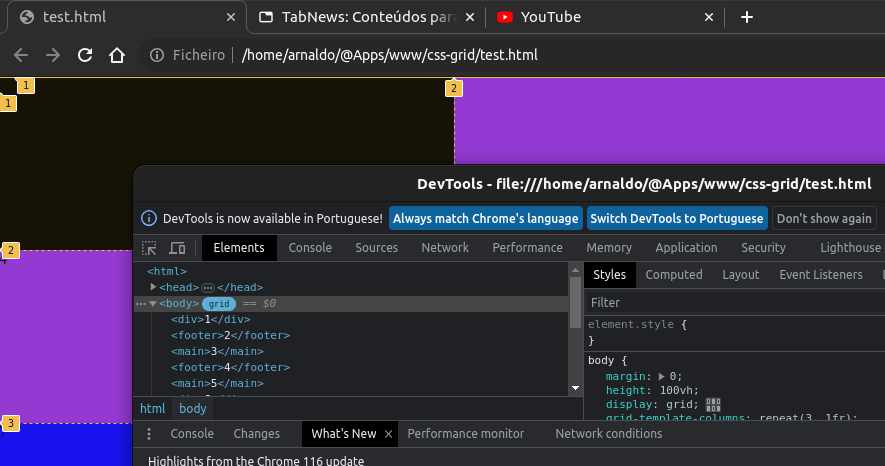
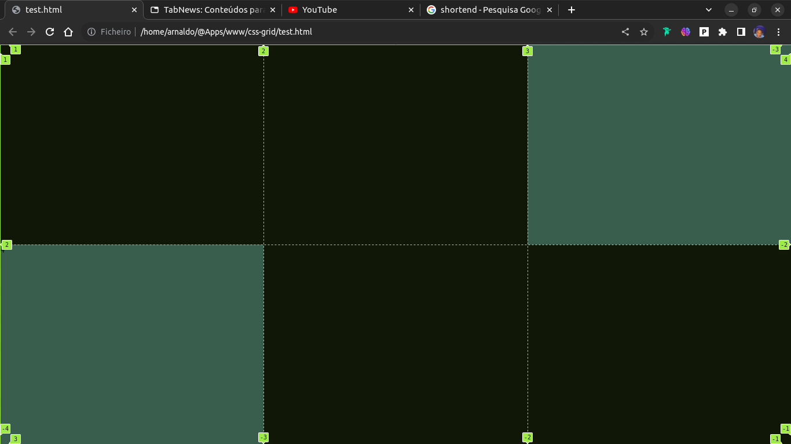
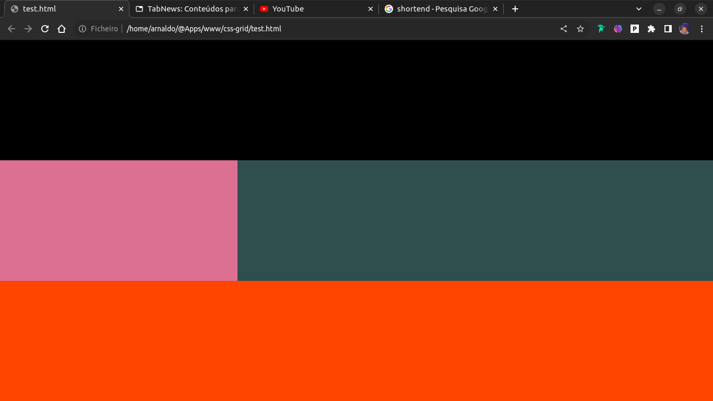

# Descomplicando Grid Layout

Permite trabalhar com linhas e colunas para posicionar os elementos na tela.  E para utilzarmos **`grid layout`** adicionamos a seguite propriedade:

```css
display: grid; 
```

Após isso devemos definir a quantidade de linhas `rows` ou colunas `columns`, ou seja, o nosso`template` com as propriedades:

```css
grid-template-columns: 300px 1fr;
```

É importante perceber que definimos isso com os seus respectivos tamanhos. O código acima está dizendo que vamos ter duas colunas, e que a primeira terá o tamanho de `300px` e a outra terá o tamanho `1fr` que é a mesma coisa que dizer 'ocupe o espaço restante'. Como podemos ver na figura abaixo:

Exemplo 1:


```html
<style>
  body {
    margin: 0;
    height: 100vh;

    display: grid;
    grid-template-columns: 300px 1fr;
  }

  div {  background-color: orangered; }
  main { background-color: blue; }
</style>

<body>
  <div></div>
  <main></main>
</body>
```

O mesmo se aplica ao definir as linhas:

```css
grid-template-rows: 100px 1fr;
```

`100px` na primeira linha e todo o resto na segunda `1fr`.

Exemplo 2:


```html
<style>
  body {
    margin: 0;
    height: 100vh;

    display: grid;
    grid-template-columns: 300px 1fr;
    grid-template-rows: 100px 1fr;
  }

  div { background-color: orangered; }
  main { background-color: blue; }
  footer { background-color: blueviolet; }
  
</style>

<body>
  <div></div>
  <main></main>
  <footer></footer>
  <div></div>
</body>
```

Ou pode também definir o tamanho e a quantidade utilizando a funcao `repeat(<numero-linhas/colunas>, <tamanho>)` :

```css
grid-template-columns: repeat(3, 1fr);
grid-template-rows: repeat(4, 1fr);

```

Exemplo 3:



<br>

## Como expandir um elemento?

Também podemos definir número de linhas`rows` e colunas`columns` que um elemento vai ocupar, através de linhas virtuais:

```css
grid-column-start: 1;
grid-column-end: 3;
/* Shortend */
grid-column: 1/3;
```

Assim estaremos dizendo que o nosso elemento vai da primeira linha virtual até a terceira da nossa coluna;
Para ver as linhas virtuais inspecione e selecione o seu container `grid`, assim:



E assim já poderá ver as linahs virtuais.
Exemplo 5:



```html
<style>
  body {
    margin: 0;
    height: 100vh;

    display: grid;
    grid-template-columns: repeat(3, 1fr);
    grid-template-rows: repeat(2, 1fr);
  }

  div { 
    grid-column: 1/3;
    background-color: black; 
  }

  main { 
    background-color: darkslategray;
  }

  footer { 
    background-color: #000; 
    grid-column: 2/4;
  }
</style>

<body>
  <div>1</div>
  <main>3</main>
  <main>4</main>
  <footer>2</footer>
</body>
```

O mesmo se aplica em `rows`:

```css
grid-row-start: 1;
grid-row-end: 3;
/* Shortend */
grid-row: 1/3;
```

----

Existe ainda o `grid-template-areas` que nos ajuda posiciar um elemento onde quisermos desse jeito:

1. Primeiro temos que definir as areas:

```css
grid-template-areas: 
'header header header'
'sidebar main main'
'footer footer footer';
```

As propriedades acima definem que teremos 3 colunas 3 linhas e as suas áreas.

2. Definir cada elemento em uma área, com a propriedade`grid-area`:

```css
div { grid-area: header; }
aside { grid-area: sidebar; }
section { grid-area: main; }
.rodape { grid-area: footer; }
```

Desse jeito estamos dizendo que o nosso elemento`div` vai ocupar toda área de *header*, o `aside` toda área de *sidebar*, a `section` toda a área de *main* e o `.rodape` toda a área de *footer*.

Exemplo 6:


## Alinhamento

Podemos alinhar o nosso conteúdo`content`, os `items` ou um determinado elemento fiho`self` como podemos ver as nas propriedades abaixo abaixo:

```css
align-items: value;
align-content: value;
align-self: value;

justify-items: value;
justify-content: value;
justify-self: value;

place-items: value;
place-content: value;
place-self: value;
```

O `align` trabalha com o alinhamento vertical, o `justify` com horizontal e o `place` com os dois anteriores.

Essas propriedades possuem alguns valores como:

- *strecth*
- *start*
- *end*
- *center*
- *space-between*
- *space-around*
- *space-evenly*

<br> <br>

Sou um dev júnior que tinha bastante dificuldades com `grid layout` e graças ao estudo que fiz e consegui superar. Se pelo menos uma pessoa também aprender com esse conteúdo, ficarei feliz de ter compartilhado esse conhecimento. Espero que curtam.